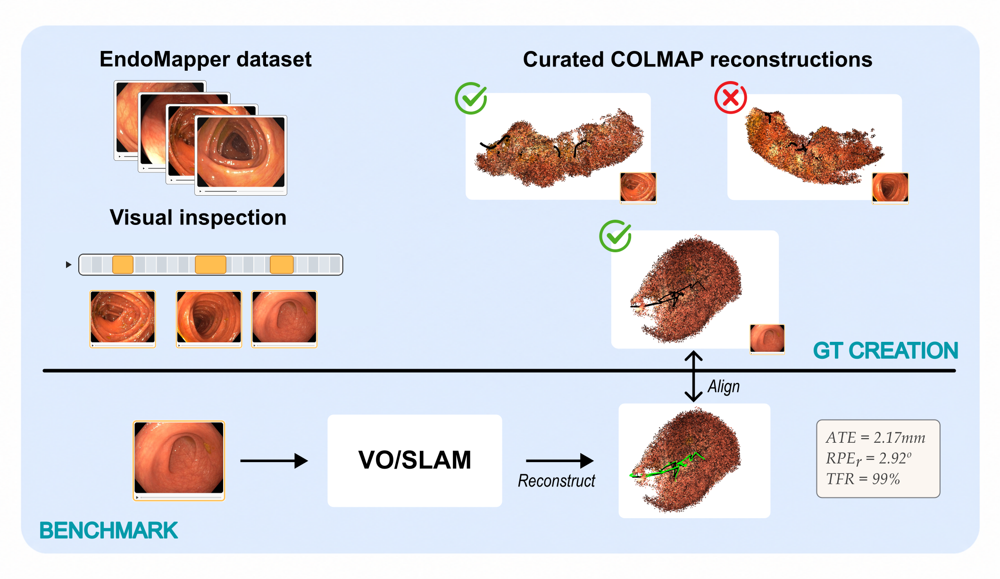

# CLiMB: Colonoscopy Localization and Mapping Benchmark

CLiMB is a benchmark challenge for SLAM and localization methods on colonoscopy sequences. Participants are evaluated on trajectory estimation against COLMAP reconstructions and ground-truth poses. CLiMB is part of EndoVis 2026 at MICCAI 2026 (Strasbourg, France).

- [Challenge website](https://www.synapse.org/Synapse:syn74370700/wiki/639980)
- [EndoMapper Dataset](https://www.synapse.org/Synapse:syn26707219/wiki/615178)
- [EndoVis Challenge](https://opencas.dkfz.de/endovis/challenges/2026/)
- **[Submission instructions](submission_instructions/README.md)** ← authoritative contract for participants


<p align="center">
  
</p>

---

## Pose convention

Estimated poses are written in **camera-to-world** form (`T_wc`):

- `(tx, ty, tz)` is the **camera center in world coordinates** (`C_w`).
- `(qw, qx, qy, qz)` is the **camera-to-world** rotation quaternion (`w` first).

A 3D point `X_c` expressed in the camera frame maps to world coordinates as:

```
X_w = R_wc · X_c + C_w,    with R_wc = qvec2rotmat(qw, qx, qy, qz)
```

### Trajectory file format

`camera_trajectory/cam_traj_map_<map_id:03d>.txt`: one comma-separated pose per line, `#` lines are comments:

```
# timestamp, name_image, tx, ty, tz, qw, qx, qy, qz
0.000000,000000.png,0.000000,0.000000,0.000000,1.0,0.0,0.0,0.0
0.033367,000001.png,0.001000,0.000000,0.000000,1.0,0.0,0.0,0.0
...
```

The matching key between SLAM and the COLMAP reference is the **numeric prefix** of `name_image` (e.g. `000042.png` → frame ID `42`). Make sure your numbering matches the input frame index of the video.

The first 9 fields above are required and must be in that order. **Additional trailing columns are ignored** by the evaluator, so it is safe to emit method-specific extras (the ORB-SLAM3 baseline, for example, appends `frame_state, track_state, dataset_id, merged_frame_id`).

### 3D points file format

`3D_maps/<map_id>/points3D.txt`: COLMAP-format point list, one **space-separated** point per line, `#` lines are comments:

```
# POINT3D_ID X Y Z R G B ERROR
10882 1.493889927864075 0.524629712104797 1.039334774017334 0 0 0 0
10883 1.502341000000000 0.531100000000000 1.041200000000000 0 0 0 0
...
```

`points3D.txt` is **not used for evaluation metrics**, only for visualization of the reconstructed map. Reporting `R G B` is optional but produces nicer point clouds.

- `POINT3D_ID`: integer, unique within the map.
- `X Y Z`: point coordinates in the **same world frame** as the trajectory (`T_wc`).
- `R G B`: color in `[0, 255]`; optional, fill with `0 0 0` if unused.
- `ERROR`: mean reprojection error (pixels); optional, fill with `0` if unused.

See [toy-example/run.py](toy-example/run.py) (`write_points3d`) for a minimal writer.

---

## Submission layout

Each `<seq>.mp4` produces a tree under `/output/<seq>/<run_id>/` containing `3D_maps/`, `camera_trajectory/`, and a `runtime.txt`. See [submission_instructions/README.md §Output layout](submission_instructions/README.md#output-layout) for the full tree, file-format rules, and the per-run timing contract.

### Runs per method

Each method is **executed 5 times** to mitigate non-deterministic VO/SLAM behavior; metrics are averaged across the 5 runs. The container itself is responsible for producing all 5 runs (`1/`, `2/`, …, `5/`) from a single invocation — see [submission_instructions](submission_instructions/README.md#the-container-contract).

---

## Runtime constraints

Submissions are evaluated inside a Docker container under the limits in [submission_instructions/README.md §Runtime constraints](submission_instructions/README.md#runtime-constraints) (GPU, CUDA, RAM, network, filesystem, wall-clock). The most common gotcha: the container runs with `--network=none` at evaluation time, so **bake all weights, model files, and vocabularies into the image at build time** — any runtime download will fail.

Each run must write a [`runtime.txt`](submission_instructions/README.md#runtime-reporting-runtimetxt) with `init_seconds` and `processing_seconds`; the latter feeds the [Runtime](#metrics) metric. See [toy-example/run.py](toy-example/run.py) (Python) or [ORBSLAM/entrypoint.sh](ORBSLAM/entrypoint.sh) (bash) for the timer pattern.

---

## Docker examples

Two reference implementations follow the [submission contract](submission_instructions/README.md#the-container-contract): one `docker run` reads `/input`, writes the full submission tree (all sequences × 5 runs) to `/output`. The `docker-run.sh` scripts are build-and-test helpers — they mount the local `data/` folder and verify the output tree.

### `toy-example/`: minimal I/O example

A constant-velocity stub. Use it to verify that the folder layout and file formats are correct without running a real SLAM system.

```bash
bash toy-example/docker-run.sh
```

Or directly:

```bash
docker build -t endovis-toy-example-submission:ci toy-example/
docker run --rm \
  -v "$(pwd)/data:/input:ro" \
  -v "/tmp/toy-example-output:/output" \
  endovis-toy-example-submission:ci
```

See [toy-example/run.py](toy-example/run.py) for the simplest possible writer of the submission tree.

### `ORBSLAM/`: ORB-SLAM3 baseline

A reference classical-SLAM baseline. ORB-SLAM3 is a weak baseline on colonoscopy, so its main value here is as a worked example of how to wrap a real C++ SLAM system into a CLiMB-compliant submission image. The source is vendored at [ORBSLAM/ORB-SLAM3/](ORBSLAM/ORB-SLAM3/), baked into the image at build time, and driven by an entrypoint that produces the full 5-runs-per-sequence output tree.

**Learning-based methods are explicitly welcomed.** If you're building a deep / hybrid pipeline rather than a classical SLAM, the **ALIKED + LightGlue** pose-estimation baseline from [imed-challenge/imedpe](https://github.com/imed-challenge/imedpe) is the better reference to follow, it shows how to wrap a learned feature-matching frontend into a Docker submission of the same shape we expect here with very little adjustments.

```bash
bash ORBSLAM/docker-run.sh
```

The image bundles Pangolin + ORB-SLAM3, runs `mono_endo_hculb` 5 times on each video, and writes the standard submission tree to `OUTPUT_HOST` (defaults to `/tmp/endovis-orbslam-output`). To build against a different ORB-SLAM3 checkout, replace the contents of `ORBSLAM/ORB-SLAM3/`.

---

## Evaluation

[`evaluation/slam_evaluation.py`](evaluation/slam_evaluation.py) aligns each SLAM trajectory against a COLMAP reference via a closed-form Sim(3) (Horn) and reports **ATE** and **RPE** metrics, plus PLY files for visual inspection in MeshLab / Open3D.

```bash
python evaluation/slam_evaluation.py \
    --colmap_path /path/to/colmap_gt \
    --slam_path   /path/to/submission \
    --results_file results.json \
    --verbose
```

### Expected input layout

`--colmap_path`, the COLMAP "ground truth":

```
<colmap_root>/
  <seq>/results_txt/{images.txt, points3D.txt}
  scales.csv                       # per-sequence mm scale
  traj_lengths_mm.csv              # per-sequence trajectory length
  endomapper_short_seq_frames.csv  # total frames per video
```

`--slam_path`: the submission tree described in [Submission layout](#submission-layout). Sequence folder names must match between the two trees.

### Output

For each SLAM map, the evaluator writes into `<seq>/<run_id>/3D_maps/<map_id>/`:

| File | Content |
|---|---|
| `colmap_trajectory.ply`, `colmap_points.ply`, `colmap_pyramid.ply` | COLMAP reference geometry |
| `slam_trajectory.ply`, `slam_points.ply`, `slam_pyramid.ply` | Sim(3)-aligned SLAM trajectory and map |
| `slam_original_*.ply` | SLAM in its native frame (pre-alignment) |
| `line_error.ply` | Red cylinders connecting each matched COLMAP / SLAM pose pair |

And a single JSON at `--results_file` containing per-experiment, per-sequence-mean, and global-mean metrics.

### Metrics

- **ATE** (mm, after Sim(3) alignment, converted to mm via `scales.csv` if provided).
- **RPE** at frame deltas δ ∈ {1, 10, 20, 40}: translational (mm) and rotational (deg).
- **TFR (%)**: percentage of COLMAP-reconstructed frames that the SLAM also reconstructed (`num_matched_poses / ref_images`).
- **Runtime** (s/frame): per-run `processing_seconds / N`, read from each run's [`runtime.txt`](submission_instructions/README.md#runtime-reporting-runtimetxt). `N` is the number of processed frames in the run's trajectory; `init_seconds` (model/vocabulary load, GPU warmup, video open) is recorded for audit but excluded from scoring.
- **Success**: `✓` if `TFR > 50%`, else `✗`.

A SLAM sub-map needs at least **100 frame IDs in common** with the COLMAP reference to be considered (2–2.5 seconds at the EndoMapper 40–50 fps). Below that a map is too short to be metrically meaningful, and the threshold also prevents multi-map systems from gaming ATE with many tiny cherry-picked fragments. RPE at δ=40 additionally requires at least one common-ID pair separated by 40 frames — which any sub-map clearing the 100-frame threshold will satisfy in practice.

---

## License

CLiMB is released under the [MIT License](LICENSE) — you may freely use, modify, and redistribute the evaluation code, toy example, submission instructions, and assets.

**Exception:** the vendored [ORBSLAM/ORB-SLAM3/](ORBSLAM/ORB-SLAM3/) subtree is **not** covered by the MIT license. It is distributed under **GPLv3** by the original ORB-SLAM3 authors, with a separate commercial license available from the University of Zaragoza. See [ORBSLAM/ORB-SLAM3/LICENSE](ORBSLAM/ORB-SLAM3/LICENSE) for the governing terms. If you fork the ORB-SLAM3 baseline as the starting point for your own submission, your derived work inherits GPLv3 obligations for that part.

